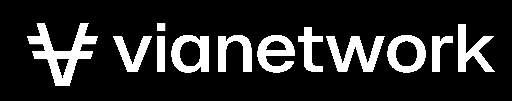

<div align="center">



<h1><code>via-brandbook</code></h1>

<strong>Logos, marks, and brand assets for Via Network.</strong>

<em>The Via wordmark and symbol — and how to use them correctly.</em>

<br />
<br />


</div>

---

## Overview

This repository holds the official Via Network visual identity: the wordmark, the standalone symbol, and the assets needed to represent the brand consistently across light and dark surfaces. Each asset ships in scalable SVG, with raster PNG provided where a fixed-resolution fallback is useful.

## Assets

### `logo/` — square mark (1024×1024)

| File | Background | Foreground | Use on |
|------|------------|------------|--------|
| `via-logo-black.svg` / `.png` | Black | White mark | Dark surfaces |
| `via-logo-white.svg` | White | Black mark | Light surfaces |
| `via-logo-orange.svg` | Orange `#FC6432` | White mark | Accent / legacy |
| `via-mark-black.svg` | Transparent | Black mark | Light surfaces, no fill |
| `via-mark-white.svg` | Transparent | White mark | Dark surfaces, no fill |

### `banner/` — wide banner (7773×1547)

| File | Background | Foreground | Use on |
|------|------------|------------|--------|
| `via-banner-black.svg` / `.png` | Black | White wordmark | Dark surfaces |
| `via-banner-white.svg` | White | Black wordmark | Light surfaces |
| `via-banner-orange.svg` | Orange `#FC6432` | White wordmark | Accent / legacy |

## Choosing an asset

- **Light website or document** → `*-white.svg` (or `via-mark-black.svg` over a custom light fill).
- **Dark website or document** → `*-black.svg` (or `via-mark-white.svg` over a custom dark fill).
- **Favicon, app icon, or social avatar** → a square `via-logo-*` file.
- **Headers, hero images, README banners** → a `via-banner-*` file.
- **Composing onto your own background** → a transparent `via-mark-*` file.

Prefer SVG wherever the renderer supports it; reach for PNG only when a raster fallback is required.

## Naming convention

```
via-<asset>-<variant>.<ext>
```

Lowercase, hyphen-separated, no spaces. `<asset>` is `logo`, `mark`, or `banner`; `<variant>` describes the background or foreground (`black`, `white`, `orange`).

## License

The Via Network name and marks remain the property of Via Network. These assets are provided for referencing and linking to Via Network; use does not imply endorsement or partnership.

> **Note:** Replace this section with your formal brand-usage policy before publishing.
